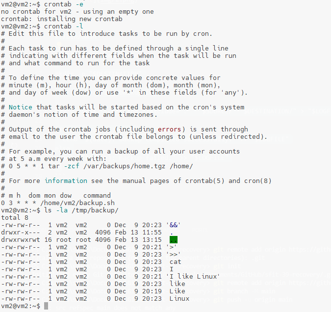

# Домашнее задание к занятию "`Резервное копирование`"

### Задание 1


### Задание 2




```
#!/bin/bash

DESTINATION=/tmp/backup

mkdir -p "$DESTINATION"

LOGFILE=/var/log/backup.log

rsync -aHAX --checksum --exclude='.*' "$SOURCE/" "$DESTINATION/" > "$LOGFILE" 2>&1

if [ $? -eq 0 ]; then
  echo "$(date): Backup completed successfully." >> "$LOGFILE"
else
  echo "$(date): Backup failed." >> "$LOGFILE"
fi
```